BabylonJS post processing & weather system
======================

**University of Pennsylvania, CIS 565: GPU Programming and Architecture, Final Project**

**This is our course final project README page, for BabylonJS README, please click [HERE](babylonJS_readme.md)**

## Project Cover

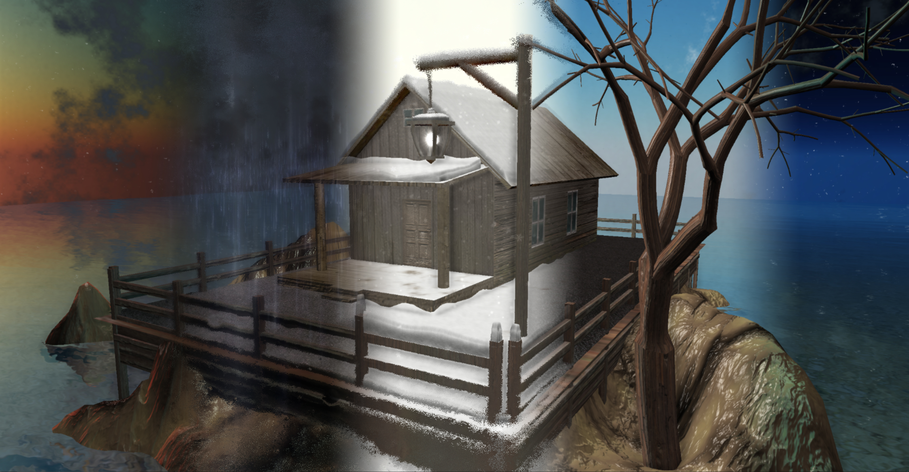

## Demo Video(Click to play)

(In our demo scene, except for the farm house model is free licensed, all other assets are original or from [BabylonJS](https://www.babylonjs.com/) official assets)

In the demo scene as shown in the video above, we largely use [BabylonJS](https://www.babylonjs.com/) build-in particle system and features we implemented in this project, which includes rain & snow materials, weather-related post processing effects, day and night cycle and optimized sky material with clouds.

## Team members:
* Hanming Zhang ([Portfolio](https://www.hanmingzhang.net/), [LinkedIn](https://www.linkedin.com/in/hanmingterrencezhang/))
* Linshen Xiao ([Portfolio](https://linshenxiao.wixsite.com/mysite
), [LinkedIn](https://www.linkedin.com/in/linshen-xiao))

## Test on:
* Browser: Google Chrome v62.0 (Advanced Settings -> Hardware(GPU) acceleration enabled)
* System and Hardware: Windows 10 Education, i7-3630QM @ 2.40GHz, 16GB, GTX 670MX 3072MB

Project Overview
================

In this project, our goal is to contribute to and extend [BabylonJS](https://www.babylonjs.com/) WebGL engine. Our main contribution relies on several post processing effects and a weather system.

List of specific [BabylonJS](https://www.babylonjs.com/) features implemented in our project:
  - post processing library:
    - stylized cartoon post processing
      - Edge Detection (Sobel filter post processing)
      - Toonify (Kuwahara style post processing)
      - Paper effect post processing
      - paper frame
    - pixelization
    - on screen rain
    - on screen frost
  - material library
    - raining ground material
    - snow material
  - day and night cycle class
  - optimized sky material with clouds

Extension of post processing library
================
## Stylized cartoon post processing
  In our stylized cartoon post processing, our post processing pipeline is like below:

  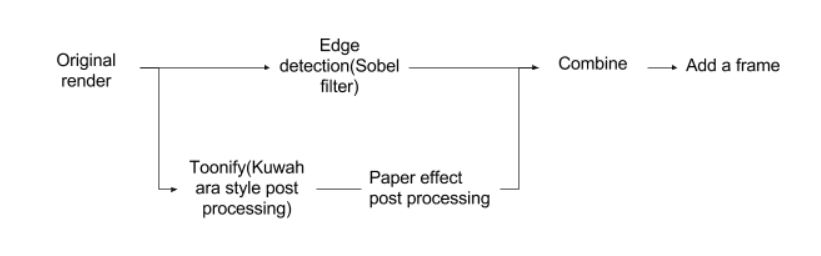

  Here are some renders after each phase:

  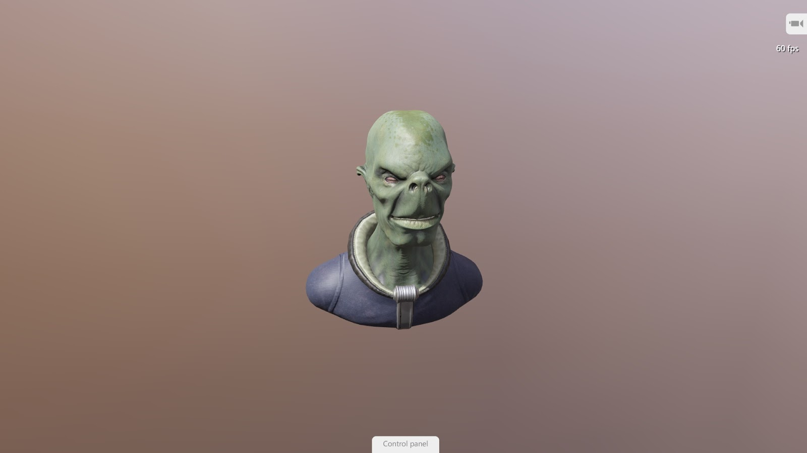 |  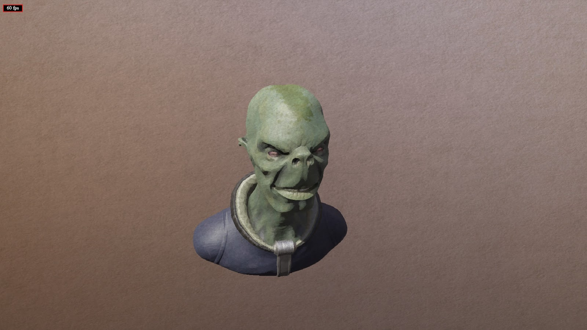 |  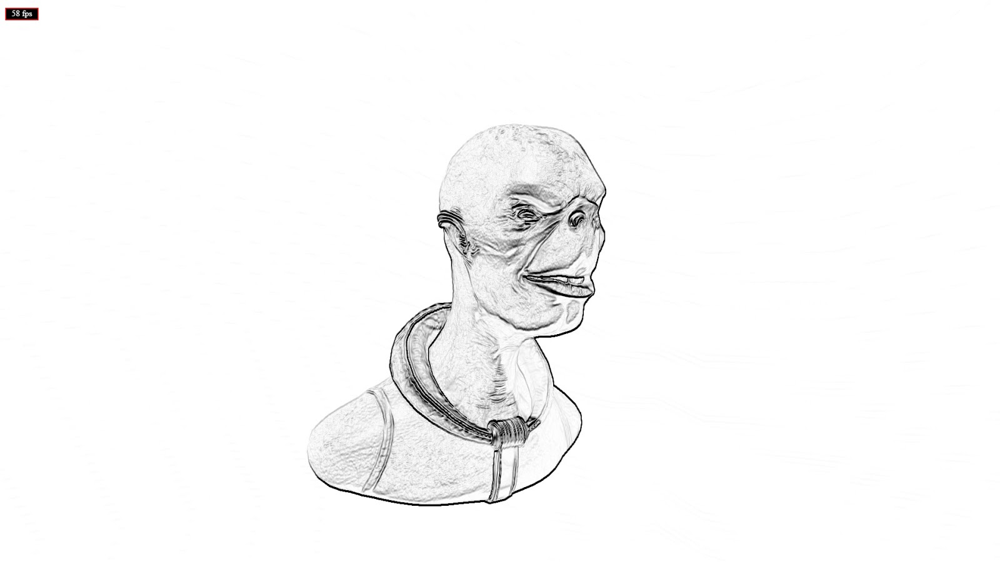
  ------------ | ------------- | -------------
  original render | Kuwahara & paper effect | edge detection

  Finally, adding a paper style frame, we have our final render.

  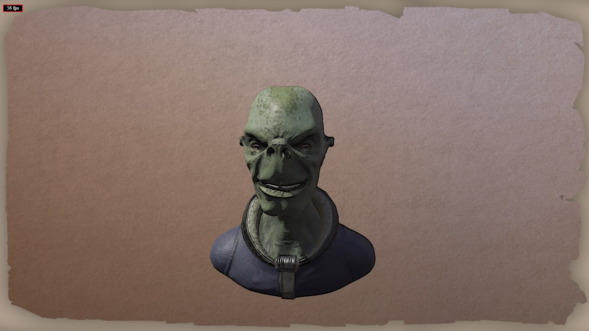

  Apply edge detection at different phases may cause different results. In our case, we directly apply edge detection on the original render, but if we apply it after Kuwahara style post processing, we can have a different image and some details can be missed. In the image below, left is later stage(details missed);  right is early stage. We can clearly see some detail difference.

  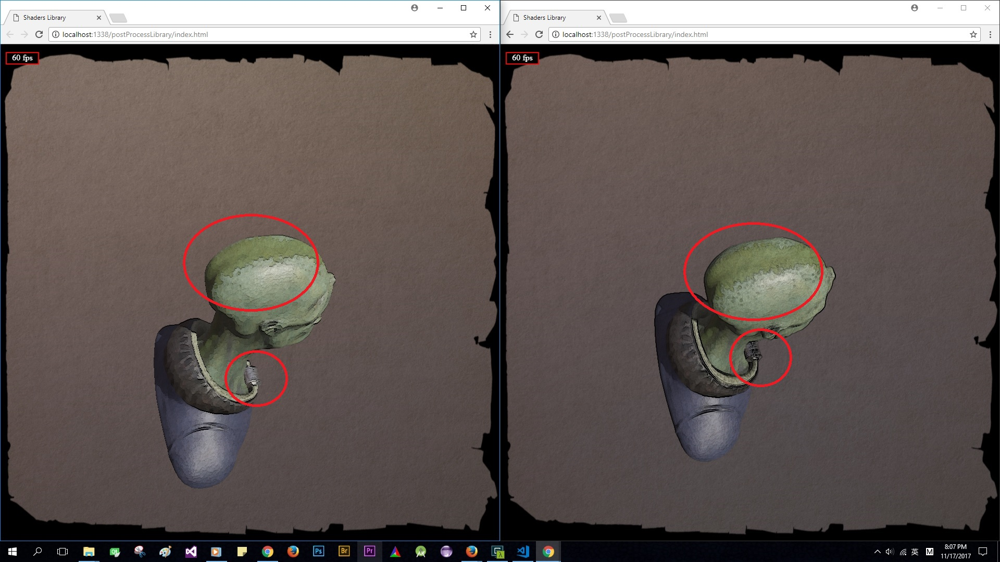

  In our implementation, we also try some different toonify methods. In the image below, the left use posterization method, and the right use Kuwahara style post processing.

  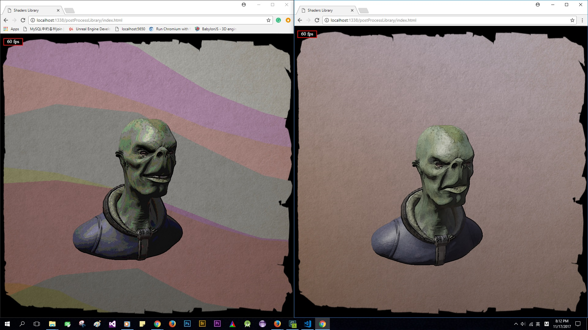

## Pixelization
  Considering [BabylonJS](https://www.babylonjs.com/) is also a very powerful WebGL game engine, we also implemented a pixelization style post processing effect, which might be useful for arcade style web game developer.

  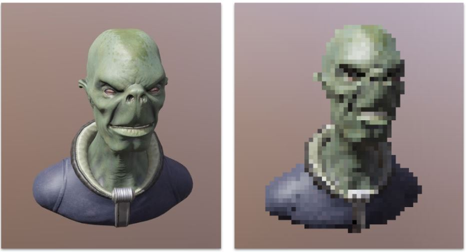

## On screen rain

  Based on https://www.shadertoy.com/view/MdfBRX

  Calculate the offsets for every uv:
  
  1. Offset the uv from center of the screen by a smoothstep function based on the distance from local uv to center;

  
  2. Let uv * vec2 to make multiple drops by divided the screen into x * y areas, for each area, the center of the drops will be fract(uv * vec2) - vec2(0.5);

  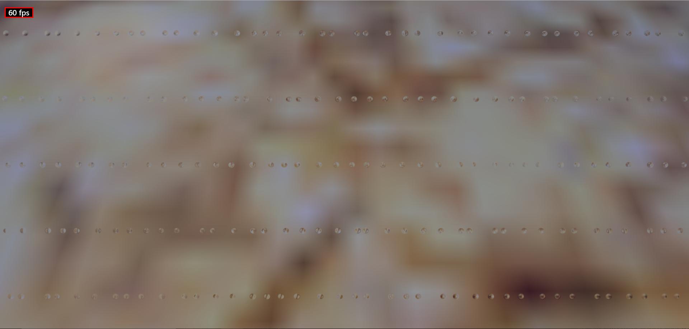
  3. Use floor(uv) for each drop as a seed for the random function. Use the noise to make the positions of the drops to be random.

  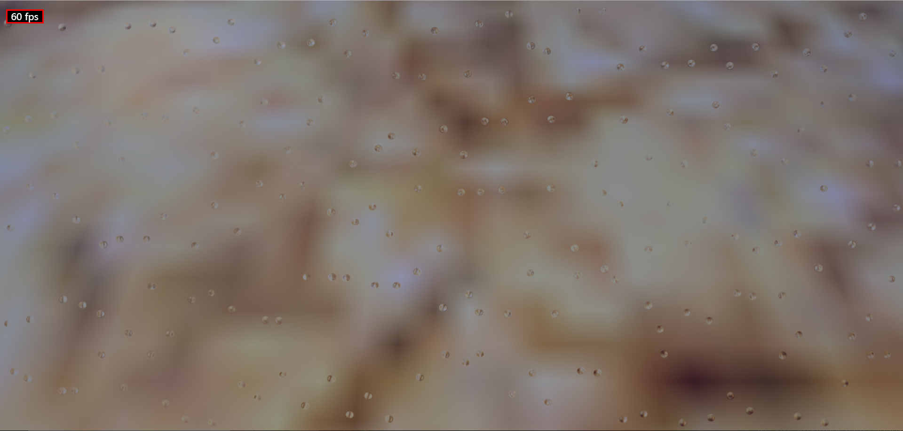
  4. Use sin, cos function to make the drops slide down; remember to use the noise to make them slide down randomly;

  
  5. Let uv * different vec2 to have size and amount of the raindrops;

  
  6. Multiply a vignette filter to make the center of the screen clean;

## On screen frost

  Based on http://coding-experiments.blogspot.com.au/2010/06/frosted-glass.html
  https://www.shadertoy.com/view/MtsSWs# & https://www.shadertoy.com/view/MsySzy

  We can get frosted glass effect by shifting pixel location with pseudo-random vector, such as after shift respective pattern emerges.
  Before the calculation of the rand function, we can add a color from a selected texture to make the final image to have frost like texture.
  Also, we can multiply a vignette filter to make the center of the screen clean.

  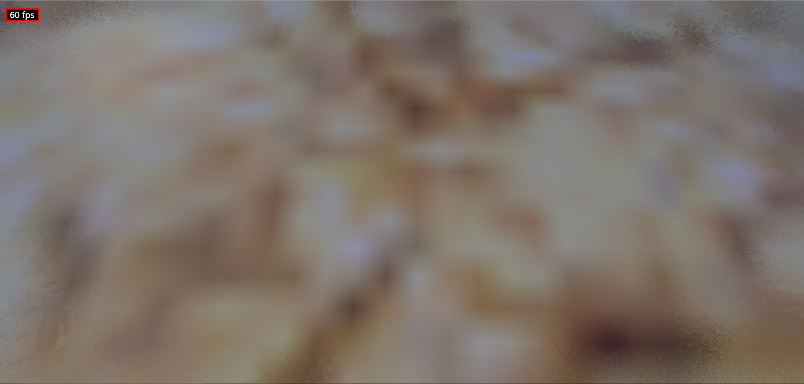

  Combined:
  

Extension of material library
================

## Raining ground material
  In a raining scene, a wet ground(may have puddles, ripples, reflection, water flow and etc.) is very important and can largely affects the overall quality of a raining scene. Inspired by [Vray wet materials](http://www.cgdigest.com/vray-wet-materials/), [wet looking materials](http://www.neilblevins.com/cg_education/wet_materials/wet_materials.htm) and [a Unreal Engine weather tool](https://www.youtube.com/watch?v=56xUbCKNYsI), we start by implementing a raining ground material. Technically, we refer a lot to AMD's awesome work, [Artist-Directable Directable Real-Time Rain Rendering in Time Rain Rendering in City Environments](http://developer.amd.com/wordpress/media/2012/10/GDC06-Advanced_D3D_Tutorial_Day-Tatarchuk-Rain.pdf) and [AMD ATI Toyshop video demo](https://www.youtube.com/watch?v=LtxvpS5AYHQ).

#### Real-time reflection
  Considering in a raining scene, reflection is the most important part and we have to have a real-time reflection on the surface of water puddles on the ground, we use WebGL render to texture(RTT) or texture buffer to get real time reflection. Also, by referring BabylonJS [water material](http://doc.babylonjs.com/extensions/water), we can have a very nice and quiet water surface:

  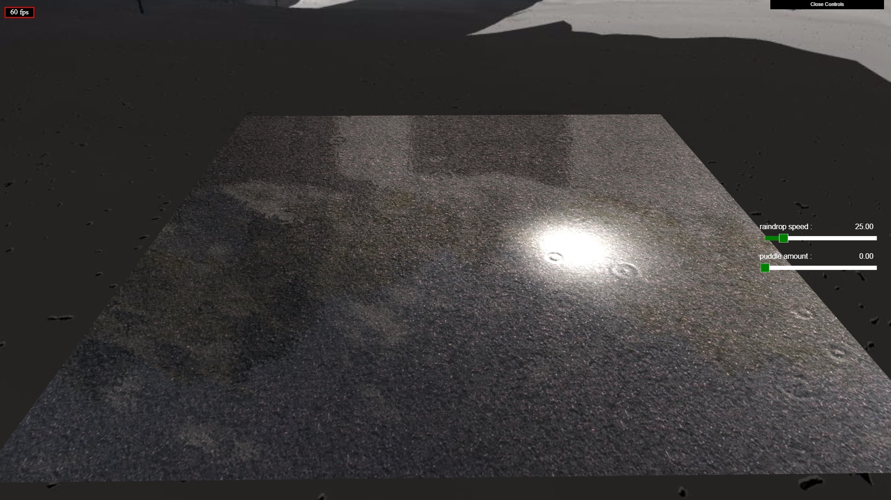

#### Water puddle
  To create a water puddle effect, we introduce a noise texture, so that we can intuitively know where should be ground and water puddles in a very cheap way. Also, by scaling a value when sample this noise texture, we can dynamically control the amount of water puddles we want(eg. scaling a very small value, the sampled values will be very close on texture so that there will be no puddles/pure water, or scaling a large value, the whole noise map will be samples, a lot of water puddles will appear). Below is a puddle mask render:

  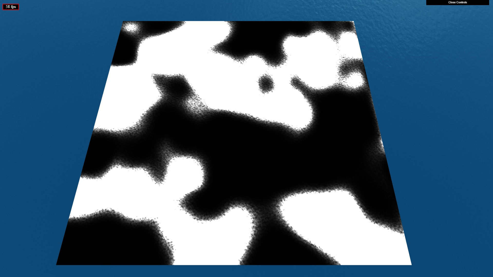

  Dynamical water puddle:

  

  With that, we use this value to lerp between the water puddle surface normal and ground normal(from normal map) to create a transition between ground and water puddles.

#### Normal blend (ground & water puddle)
  Like mentioned above, with a lerp value generated from noise sampling values, we just use it to lerp between the ground normal and water normal, and we can see a very nice transition between ground and water puddle below.

  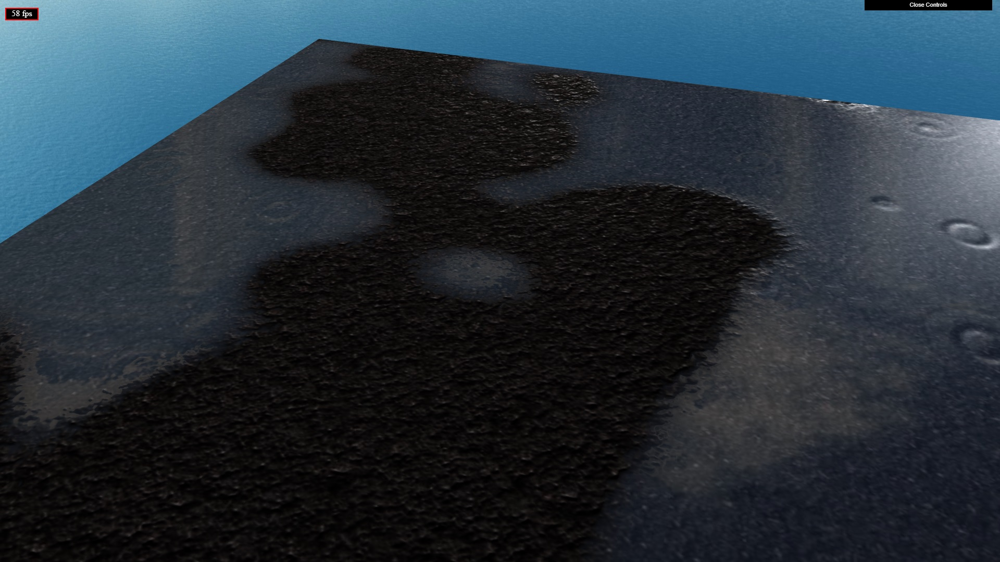

#### Water flow & ripple animation
  Thanks to detailed explanation of BabylonJS [water material](http://doc.babylonjs.com/extensions/water), water flow is relatively simple just by introducing a water bump texture and animating UV used using the time uniform variable.

  

  Animating ripples or its waves is really hard. After searching online, we realized that computing everything real time(eg. compute vertex positions using some sin or cos function) is really expensive because we are very likely to have hundreds or thousands of ripples in a raining scene at the same time. Finally, we decided to go for flip book effects, and creating ripple animations by dynamically sampling different consecutive areas of a texture. Finally, combined with raindrops and splash particles, we have something like below:

  

## Snow material

The effects we want to achieve:

  1. The up surface of the objects will become white(lerp with snow material)

  2. The snow may slowly accumulate on top of the objects

Two different types of material:

  - Make the surface of objects turn into snow:  For objects with or without uv based textures, we use triplaner mapping. We can lerp the snow texture with the original according to time, perlin noise and normal.y to achieve organic result;

  - Accumulate new snow mesh on top of the objects: This is a very limited solution. If we use the original object mesh as the snow mesh and push the vertex up as the time goes by randomly, some objects may don't have enough vertex which may make the result ugly. So, we create another smooth mesh as the snow mesh of the original one, and push the vertex up according to time, perlin noise and normal.y.

  

Day and night cycle class
================

In BabylonJS, it provides awesome [sky material](https://doc.babylonjs.com/extensions/sky), but one  thing pretty annoying is that it is totally separate from lighting in the scene(which means we have to manually adjust our lights' intensity or other properties if we change our sky material to a different scene, eg. a night scene). Besides that, although we can change our sky material based on sun position, we think it's still not intuitive enough, and change sky material based on time may be a better idea. Considering the ultimate goal of BabylonJS is simplicity(for customers/users), we decided to make a day and night cycle class to integrate all these. This class mainly consist of four parts:

  - Sky material (as input)
  - lighting(a point light as a sun, users can provide a sun position as input or just use default sun position, and a hemispheric light as ambient light), and this will synchronize a point light position(as the sun) with sky material's sun position(sky material build-in property)  
  - a cycle animation(user can set framerate or adjust sky material by setting a time) to play/pause
  - synchronize sky material's luminance(BabylonJS build-in property) with the point light(sun) intensity

We provide a BabylonJS [playground](https://www.babylonjs-playground.com/#E6OZX#160) to illustrate what we've done in this class. Or your can just try [localhost:1338/localDev/index.1.html](localhost:1338/localDev/index.1.html) and [http://localhost:1338/postProcessLibrary/index.6.html](http://localhost:1338/postProcessLibrary/index.6.html) if you want to run our project(please see install and build instructions section first).

Optimized sky material with clouds
================

  The effects we want to achieve:

  In BabylonJS, we already got a [sky material](https://doc.babylonjs.com/extensions/sky), but it's a relatively simple version(eg. totally black in the night) and our goal is to optimized it. Here are our targets:

  1. Add procedural cloud;

  2. Add stars for night;

  3. Add day and night cycle;

#### Clouds:

  Based on:
  Fractal Brownian Motion: https://thebookofshaders.com/13/;
  2D Fast Clouds: https: //www.shadertoy.com/view/XsjSRt;
  Sun & Cloud dome: https://www.shadertoy.com/view/4tf3RM;
  Hash without Sine: https://www.shadertoy.com/view/4djSRW;
  1D, 2D & 3D Value Noise: https://www.shadertoy.com/view/4dS3Wd;
  Noise - value - 3D: https://www.shadertoy.com/view/4sfGzS;

  We use Fractal Brownian Motion for the cloud simulation on 3d space(according to position instead of uv); As this is a very commonly used way to simulate clouds, we won't cover much details here; Also, we make the color of the clouds to change with the sun's position;

  

#### Stars & Night:

  For stars: Actually, stars are just extremely small scale of clouds with white color; Also, the stars will only appears in night according to the sun's position;

  

  For night: We don't want physically correct night as long as the result is pleasing. So we simply lower the rayleigh, turbidity and mieCoefficient of the original skymaterial to achieve similar night effect(which is actually simulating the sun in outer space without much atomsphere instead of the moon in the sky). We use the oppoiste position of the sun as the moon's position to achieve day and night cycle.

  

Performance Analysis
================

#### the Performance test runs on Google Chrome version 62.0.3202.94 (Official Build) (64-bit) and under 1920 x 1080 resolution.

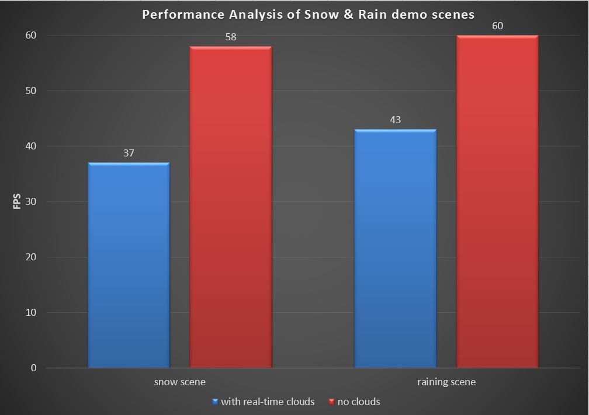

as we can see in the graph above, considering Chrome browser atomically locks on 60 FPS(it seems that we can on longer unlock that in the latest versions), performance is pretty well and stable without real-time sky material clouds. To achieve a realistic scene, in our sky material, we generate dynamically generate  real-time clouds from noise textures. We get a very good visual quality, but it's also a very expensive way in real scenes, and the performance drops about 30%.

Besides that, although we have thousands of particles in our scenes, they are all billboards, and post processing also doesn't influence performance much.

Install and Build Instructions
================

We will try to pull request our features to BabylonJS ASAP, and we are sure you can try them on [BabylonJS](https://www.babylonjs.com/) very soon. If you are interested in how to implement these features, please do as follows:

1. Clone our Project
2. Install [nodejs](https://nodejs.org/en/) and its package manager
3. Install [Visual Studio Code](https://code.visualstudio.com/)
4. Mavigate to the BJS folder and install the BJS required node modules through npm:

  cd BabylonJS/Tools/Gulp

  npm install

5. Debug

  Open VSCode on the cloned BabylonJS folder and launch the test task. To do so, 3 solutions:

  - Use the shortcut to run a task (Ctrl+Shift+p) and begin to type test. You should be on run test task, so hit enter.
  - Use the shortcut bind to the command in your keyboard bindings (default is Ctrl+Alt+Shift+t)
  - Open a terminal on Tools/Gulp and run gulp run

  This has been hijacked for your convenience and will watch all the files you are modifying as well as web serve the files for development purpose. As you noticed in the VSCode installation you can easily hook it up to a keyboard shortcut.

  Once the task is launched you can kill it by repsectively:

  - Use the shortcut to run a task (Ctrl+Shift+p) and begin to type terminate. You should be on Terminate Running Task task, so hit enter.
  - Use the shortcut you previously bind to the command in your keyboard bindings (default is Ctrl+Alt+Shift+k)
  - In the terminal press Ctrl+c

  For more details and specific instructions, please refer to [how to start contributing to BabylonJS](http://doc.babylonjs.com/how_to/how_to_start#adding-files)

  Here are some debug pages for each feature we implemented during our developing process. They will run and show you our demo scenes if everything works fine:

  Day and night cycle : [localhost:1338/localDev/index.1.html](localhost:1338/localDev/index.1.html) and [http://localhost:1338/postProcessLibrary/index.6.html](http://localhost:1338/postProcessLibrary/index.6.html)

  raining ground material : [localhost:1338/materialsLibrary/index.1.html](localhost:1338/materialsLibrary/index.1.html)

  Cartoon style post processing : [http://localhost:1338/postProcessLibrary/index.html](http://localhost:1338/postProcessLibrary/index.html)

  Pixelization post processing :
  [http://localhost:1338/postProcessLibrary/index.1.html](http://localhost:1338/postProcessLibrary/index.1.html)

  Simple raining scene with raining material, particles and raining & frost post processing : [http://localhost:1338/postProcessLibrary/index.2.html](http://localhost:1338/postProcessLibrary/index.2.html)

  Demo snow scene : [http://localhost:1338/postProcessLibrary/index.4.html](http://localhost:1338/postProcessLibrary/index.4.html)

  Demo raining scene : [http://localhost:1338/postProcessLibrary/index.5.html](http://localhost:1338/postProcessLibrary/index.5.html)

Credits
================
* [BabylonJS](https://www.babylonjs.com/)
* [Sobel Operator](https://en.wikipedia.org/wiki/Sobel_operator)
* [Sobel Edge Detection Filter discussion on StackExchange ](https://computergraphics.stackexchange.com/questions/3646/opengl-glsl-sobel-edge-detection-filter)
* [BabylonJS sky material](https://doc.babylonjs.com/extensions/sky)
* [Vray wet materials](http://www.cgdigest.com/vray-wet-materials/)
* [wet looking materials](http://www.neilblevins.com/cg_education/wet_materials/wet_materials.htm)
* [Artist-Directable Directable Real-Time Rain Rendering in Time Rain Rendering in City Environments](http://developer.amd.com/wordpress/media/2012/10/GDC06-Advanced_D3D_Tutorial_Day-Tatarchuk-Rain.pdf)
* [AMD ATI Toyshop video demo](https://www.youtube.com/watch?v=LtxvpS5AYHQ)
* [UE4 Weather Tool](https://www.youtube.com/watch?v=56xUbCKNYsI)
* [Fractal Brownian Motion](https://thebookofshaders.com/13/)
* [2D Fast Clouds](https://www.shadertoy.com/view/XsjSRt)
* [Sun & Cloud dome](https://www.shadertoy.com/view/4tf3RM)
* [Hash without Sine](https://www.shadertoy.com/view/4djSRW)
* [1D, 2D & 3D Value Noise](https://www.shadertoy.com/view/4dS3Wd)
* [Noise - value - 3D](https://www.shadertoy.com/view/4sfGzS)
* [Frosted glass Pixel Shader](http://coding-experiments.blogspot.com.au/2010/06/frosted-glass.html)
* [Frosted Glass](https://www.shadertoy.com/view/MtsSWs)
* [frosted glass vignette](https://www.shadertoy.com/view/MsySzy)
* [The Drive Home](https://www.shadertoy.com/view/MdfBRX)
* [Anisotropic Kuwahara Filtering on the GPU](http://www.kyprianidis.com/p/gpupro/)
